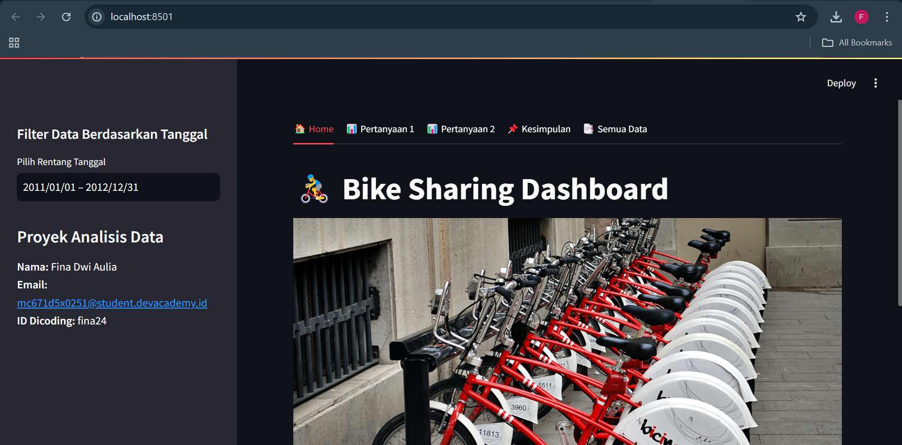

# 🚴‍♂️ Bike Sharing Dashboard  

🔗 Akses Dashboard Online: [Bike Sharing Dashboard](https://bike-sharing-dashboard-dupquvstbzkeuf6benwjcx.streamlit.app/)


Dashboard interaktif untuk menganalisis pola peminjaman sepeda menggunakan **Bike Sharing Dataset**.  
Dibangun dengan **Streamlit**, **Pandas**, dan **Matplotlib** untuk memberikan visualisasi data yang informatif dan interaktif.

---

## 📌 Fitur  
✅ **Filter Data** berdasarkan rentang tanggal  
✅ **Analisis Pengguna** (kasual vs terdaftar) berdasarkan hari kerja dan akhir pekan  
✅ **Heatmap Permintaan Sepeda** berdasarkan hari dan jam peminjaman  
✅ **Visualisasi Tren & Pola** dengan grafik yang mudah dipahami  
✅ **Kesimpulan & Insight** dari data yang dianalisis  

---

## 📊 Dataset  
Dataset yang digunakan dalam analisis ini:  
- **day_clean.csv** → Data peminjaman sepeda per hari  
- **hour_clean.csv** → Data peminjaman sepeda per jam  

Sumber data: *[Bike Sharing Dataset - Kaggle](https://www.kaggle.com/datasets/lakshmi25npathi/bike-sharing-dataset)*  

---

## 🛠️ Instalasi & Menjalankan Aplikasi  
1️⃣ **Clone repositori ini**  
   ```bash
   git clone https://github.com/Fina2404/bike-sharing-dashboard.git
   cd bike-sharing-dashboard
   ```

2️⃣ **Install dependensi**  
   ```bash
   pip install -r requirements.txt
   ```

3️⃣ **Jalankan aplikasi Streamlit**  
   ```bash
   streamlit run dashboard.py
   ```

---

## 📷 Tampilan Dashboard  
  

---

🚀 Selamat menggunakan dashboard ini! Jika ada pertanyaan atau saran, silakan ajukan melalui [issues](https://github.com/Fina2404/bike-sharing-dashboard/issues).

